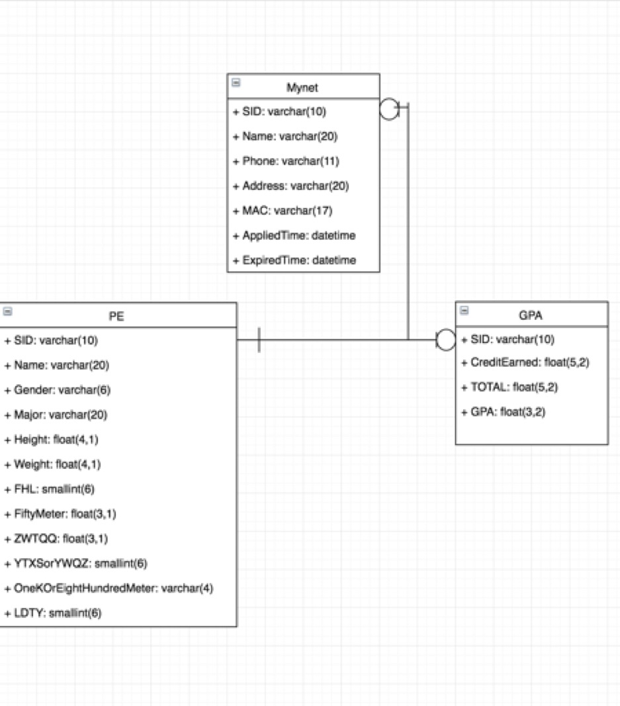

# jnu_database

JNU student information query database application.

## Features

- GPA information
- P.E. information
- Mynet Information

## Database E-R Diagram



## Server Side Dependencies

````
"express": "~4.13.4",
"mysql": "~2.10.2",
"body-parser": "~1.15.0",
"passport": "~0.3.2",
"mongoose": "~4.4.19",
"crypto": "0.0.3",
"passport-local": "~1.0.0",
"ejs": "~2.4.1",
"express-session": "~1.13.0",
"connect-flash": "~0.1.1"
````

## Client Side Dependencies

````
"angular-route": "^1.5.3",
"bootstrap": "^3.3.6",
"angular": "^1.5.5",
"angular-resource": "^1.5.5"
````

## Getting Started

Clone Repo

````
git clone https://github.com/BruceWangNo1/jnu_database.git
````

NPM Dependencies Installation
````
cd jnu_database & npm install
````

BOWER Denpendecies Installation
````
bower install
````

Create credentials directory in config directory and credentials.js in credentials directory
````
cd config & mkdir credentials & cd credentials & vim credentials.js
````
````
module.exports = {
	db: 'mongodb://localhost/yourUserDatabase',
	sessionSecret: 'yourSessionSecret',
	mysql:{
		host: 'local or remote host name',
		user: '',
		password: '',
		database: 'informationDatabase'
	}
}
````

Start Mongodb (in Ubuntu Environment)

````
mongod
````

Start Server

````
cd .. & node server.js
````

## Maintenance

PM2 is a production process manager for Node.js applications with a built-in load balancer. It allows you to keep applications alive forever, to reload them without downtime and to facilitate common system admin tasks.

````
npm install pm2 -g
pm2 start server.js -i 0 --name "service_name"
pm2 stop service_name
pm2 delete service_name
pm2 list
````

## Contributing

Contributions to this project are welcome.

## License

GNU GENERAL PUBLIC LICENSE

## For More Information

* [JNU Student Information Query Website][] 
* [PM2 Github Page][]

[JNU Student Information Query Website]: http://query.pressureandtime.com
[PM2 Github Page]: https://github.com/Unitech/pm2